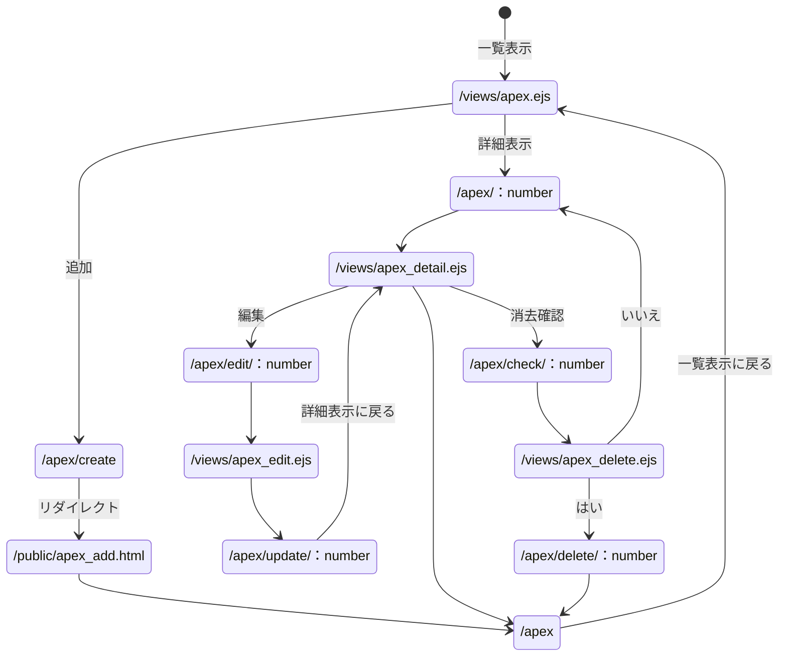

```mermaid
stateDiagram-v2
    [*] --> /views/apex.ejs:一覧表示
    /views/apex.ejs --> /apex/create:追加
    /apex/create --> /public/apex_add.html:リダイレクト
    /public/apex_add.html --> /apex
    /apex --> /views/apex.ejs:一覧表示に戻る

    /views/apex.ejs --> /apex/：number:詳細表示
    /apex/：number --> /views/apex_detail.ejs

    /views/apex_detail.ejs --> /apex/edit/：number:編集
    /apex/edit/：number --> /views/apex_edit.ejs
    /views/apex_edit.ejs --> /apex/update/：number
    /apex/update/：number --> /views/apex_detail.ejs:詳細表示に戻る

    /views/apex_detail.ejs --> /apex

    /views/apex_detail.ejs --> /apex/check/：number:消去確認
    /apex/check/：number --> /views/apex_delete.ejs

    /views/apex_delete.ejs --> /apex/：number:いいえ


    /views/apex_delete.ejs --> /apex/delete/：number:はい
    /apex/delete/：number --> /apex

```